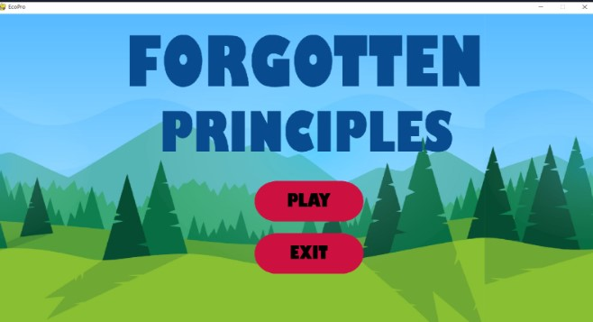
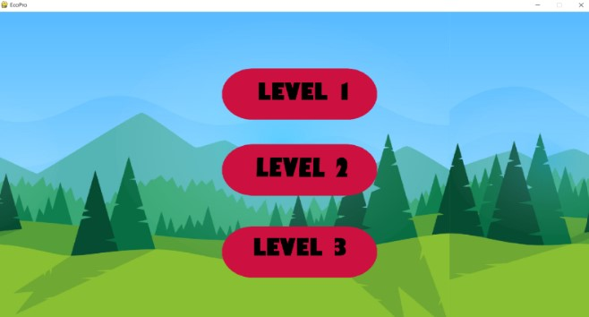
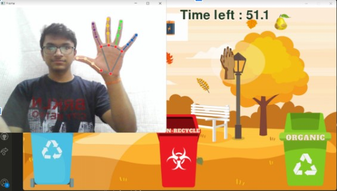
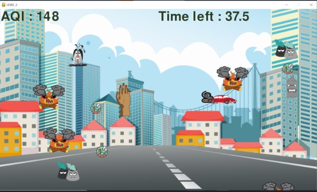
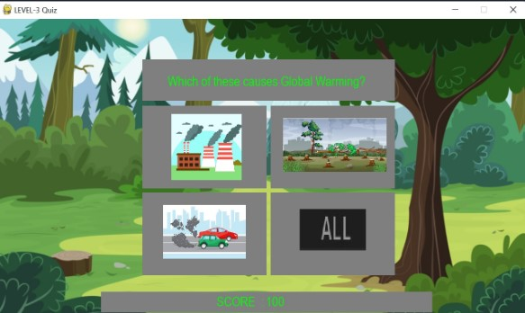

# Forgotten Principles: It’s all about recycling

## Description:
* Video games and digital media can be of great assistance in inculcating habits that are essential but not flashy

* A virtual environment can greatly help in developing sustainable habits in citizens. Eventually, they develop these habits and incorporate them into their lifestyle.

* This user-friendly game is to motivate users to take eco-conscious actions and learn how they can have an impact on climate justice.

* __Best part:__ The game is controlled with hand movements and motions. This will ensure that user remains physically active while playing the game.

---

## Features:
* Entire game is implemented in python
* _OpenCV_ is used to track user's hand motion
* _Hand Detecting Modules_ process real-time camera feed and hand gestures are identified
* This makes the game more interactive. Instead of using a mouse or keyboard, the player can use his hands to control the game (Mimic real life situation)
* This engages children to play games like this and learn more about eco-friendly methods
* __PyGame__ is used for creating the necessary graphics and UI
* Use of __self-designed graphics__ that are easy for users to understand
* There are 3 levels in the game, with each one having its own objective

---

## MAIN MENU

---

## LEVEL-1: GRAB THE GARBAGE
* This level is about __Waste Management__ 
* When you start this level, you will see _recyclable_, _non-recyclable_ and _organic_ wastes on the ground and you task is to pick the waste and throw it in the correct _trash can_. 
* Handtracking (OpenCV) is used in this level. Your hand is mapped to a virtual hand which you can see on your screen. Close your fingers and make a fist to pick the waste and release the fist to drop it.

  

---

## LEVEL-2: POP THE POLLUTANT
* This level is about __Air pollution__.
* In this level, you can see the _AQI (Air Quality Index)_ displayed on screen. And some pollutants will be moving towards the top, 
and you need to pop them before they escape.
* If they reach the top, then the AQI will increase, indicating that the quality of air is decreasing. 
* Just like  the previous level, your hand is mapped to a virtual hand which you can see on your screen. Here also, you need to make a fist to pop the pollutant. 

    

---

## LEVEL-3: QUIZ GAME
* In this level, you need to answer a __Quiz__ based on eco-friendly methods.
* This quiz will be _Choose the Correct Answer_ type.
* Each question has 4 options. For each _correct answer_, you score __50__ points.
* On answering correctly, you advance to next levels which are more challenging!

    

